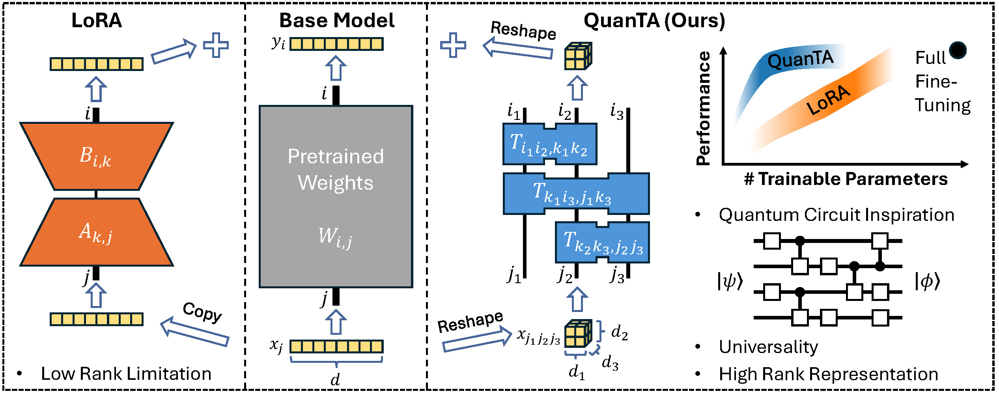

# QuanTA: Efficient High-Rank Fine-Tuning of LLMs with Quantum-Informed Tensor Adaptation
Official implementation of **QuanTA**: Efficient High-Rank Fine-Tuning of LLMs with **Quan**tum-Informed **T**ensor **A**daptation (https://arxiv.org/abs/2406.00132)



### To cite our paper
```
@misc{chen2024quanta,
      title={QuanTA: Efficient High-Rank Fine-Tuning of LLMs with Quantum-Informed Tensor Adaptation}, 
      author={Zhuo Chen and Rumen Dangovski and Charlotte Loh and Owen Dugan and Di Luo and Marin Soljačić},
      year={2024},
      eprint={2406.00132},
      archivePrefix={arXiv},
      primaryClass={cs.LG}
}
```

## Quickstart

 ```bash
git clone https://github.com/quanta-fine-tuning/quanta.git
cd quanta/quanta/
pip install -e .
pip install wandb datasets accelerate sentencepiece opt_einsum
cd ../run/
# complete llama signup at https://huggingface.co/meta-llama/Llama-2-7b-hf
# and get HF token from https://huggingface.co/settings/tokens
export HF_TOKEN=<your-huggingface-read-token>
bash run.sh
```
